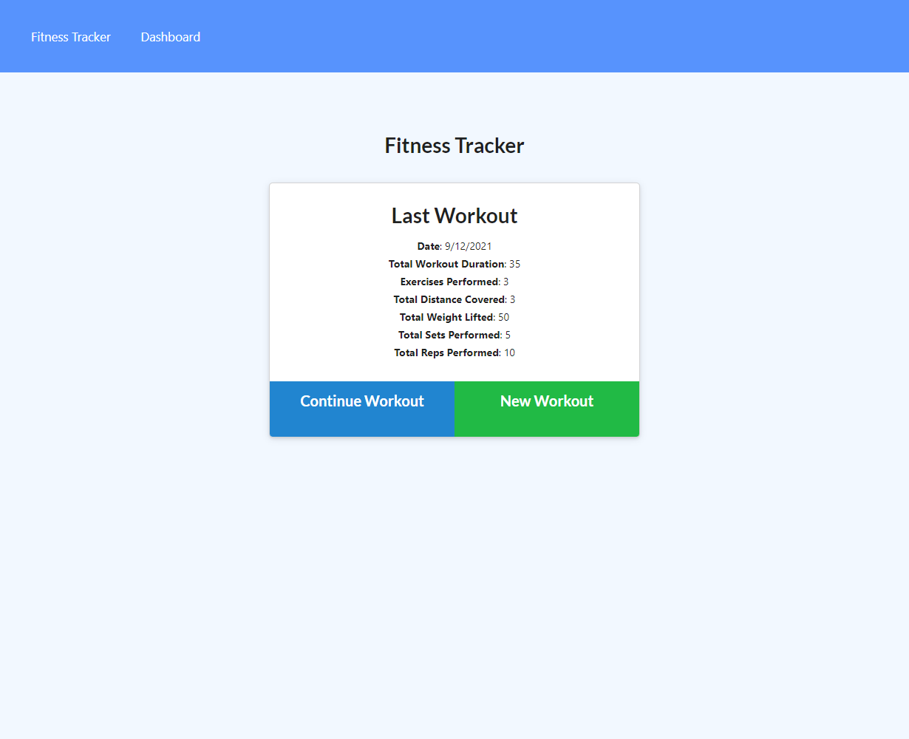
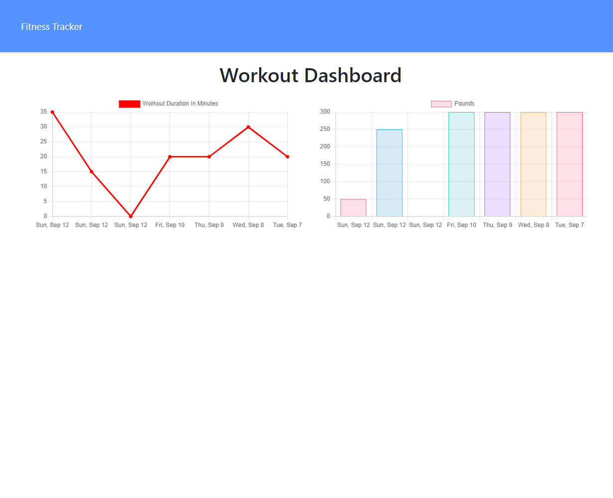

# Workout Tracker App

## Description
An online app for tracking your workout performance, using mongodb and express.js

## Screenshots

## Installation
Required: Node.js and mongodb.

After cloning the repository, run the command **npm install** or **npm i**. If you wish to start with seed data, edit the file '/seeders/seed.js'. To seed the database, run the command **npm run seed**.

## Usage
To run the server locally, run the command **npm run start**, then connect to 'http://localhost:3001' in your browser.

## Questions
If you have any questions about this project, you can find me on GitHub as [jcpickens0215](https://github.com/jcpickens0215).

## License

Licensed under the [MIT License](https://mit-license.org/)
, copyright 2021 by Justin Pickens
____

Badges provided by [Shields.io](https://shields.io/)